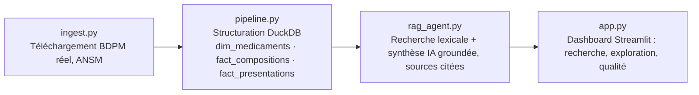

# PharmAUtomate

🔗 **Démo live** : [pharm-automate-aulwv7ggcqkko6ztdrua2d.streamlit.app](https://pharm-automate-aulwv7ggcqkko6ztdrua2d.streamlit.app)

⚠️ **Projet personnel (PoC)**, démonstration de méthode. Données **réelles et publiques** (pas simulées) : Base de Données Publique des Médicaments (BDPM), diffusée par l'ANSM sous licence ouverte Etalab. Aucune donnée patient, aucune donnée confidentielle, aucun laboratoire ni ESN cité. Source citée à chaque usage conformément à la licence : [base-donnees-publique.medicaments.gouv.fr](https://base-donnees-publique.medicaments.gouv.fr).

Je voulais comprendre comment structurer et interroger de façon fiable un référentiel réglementaire volumineux et non trivial à exploiter (encodage hérité, fichiers multiples à relier, vocabulaire médical exact), sans jamais laisser une IA halluciner une réponse sur un sujet aussi sensible qu'un médicament, alors j'ai construit ce projet.

## Ce que ça résout

Un référentiel réglementaire public existe (la BDPM), mais reste peu exploitable tel quel : encodage ISO-8859-1 hérité, fichiers séparés à relier (médicaments / compositions / présentations et prix), aucune interface de recherche en langage naturel. Ce projet montre comment :
- ingérer et structurer un référentiel public réel dans un modèle relationnel propre (pas de données inventées, pas de mock),
- vérifier l'intégrité référentielle entre les fichiers plutôt que de supposer qu'ils se recoupent parfaitement,
- construire un agent de recherche cadré (RAG lexical) qui ne répond **qu'à partir des données réellement trouvées dans la base**, cite systématiquement le code CIS de chaque médicament mentionné, et dit explicitement quand l'information n'y est pas plutôt que de l'inventer.

## Architecture



## Fonctionnalités

1. **Ingestion réelle** (`src/ingest.py`) : téléchargement direct des 3 fichiers officiels BDPM (spécialités, compositions, présentations), mis à jour mensuellement par l'ANSM, mise en cache locale simple.
2. **Structuration relationnelle** (`src/pipeline.py`, DuckDB) : modèle `dim_medicaments` + `fact_compositions` + `fact_presentations`, avec contrôle d'intégrité référentielle explicite (compositions/présentations sans médicament associé, comptées et affichées, jamais corrigées en silence).
3. **Agent de recherche cadré** (`src/rag_agent.py`) : recherche lexicale sur les noms de médicaments et substances actives, priorisation des médicaments réellement commercialisés, puis synthèse IA (Claude, BYOK) strictement groundée sur les fiches trouvées, avec citation systématique des codes CIS. Fonctionne aussi sans clé API : affichage direct des fiches sources.
4. **Dashboard Streamlit** : recherche IA, exploration filtrable des 3 tables, tableau de bord qualité (intégrité référentielle, répartition par état de commercialisation, substances les plus fréquentes).

Sur le dernier chargement : 15 857 médicaments, 32 420 lignes de composition, 20 895 présentations commerciales, 99,99% d'intégrité référentielle (4 présentations orphelines sur 20 895, aucune composition orpheline).

## Stack

Python · Requests (ingestion) · DuckDB (entrepôt SQL embarqué) · Recherche lexicale + Claude Haiku (BYOK, synthèse groundée) · Streamlit · Pytest.

## Lancer en local

```bash
pip install -r requirements.txt
streamlit run app.py
```

Le premier lancement télécharge les 3 fichiers BDPM (quelques Mo, mis en cache localement ensuite). Une clé API Anthropic est optionnelle (BYOK, jamais stockée) : sans clé, les fiches sources s'affichent directement sans synthèse IA.

## Pour une mission réelle

Cette architecture se transpose à tout référentiel réglementaire ou technique volumineux (fiches produit, notices, documentation normative) : ingestion, structuration relationnelle avec contrôle d'intégrité, et recherche IA cadrée avec sources vérifiables. Contact via [Sovereign Career](https://www.sovereigncareer.fr/freelance/freelance-consultant-data-steward-gisele-metouck).

---

Playbook complet (Définitions/Process/Documentation/Templates) : [`PLAYBOOK.md`](PLAYBOOK.md).
Construit avec l'IA, méthode documentée dans [`PROMPT_LOG.md`](PROMPT_LOG.md).
**Gisèle Metouck**, Consultante Data Steward & Gouvernance · [GitHub](https://github.com/Kingdmfncr)
